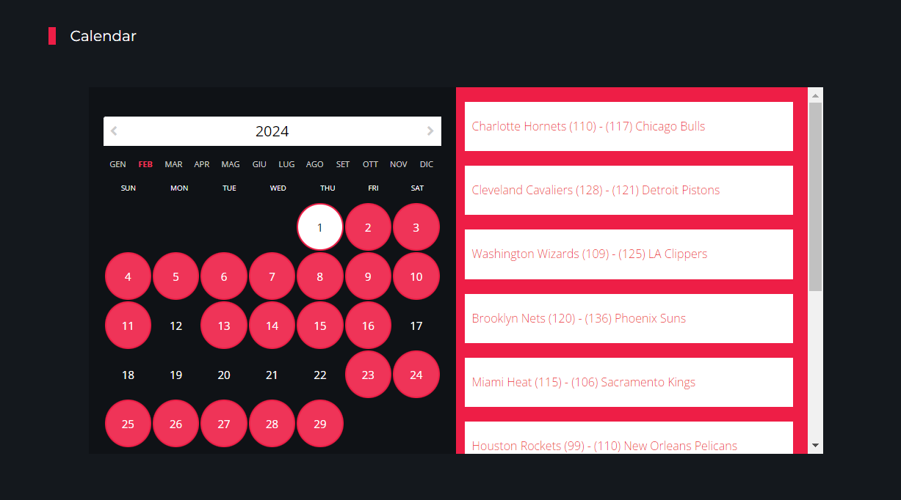
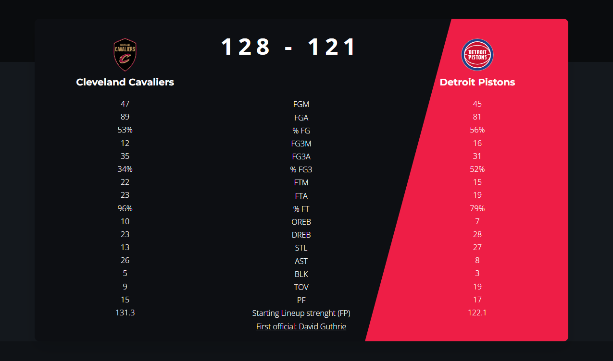
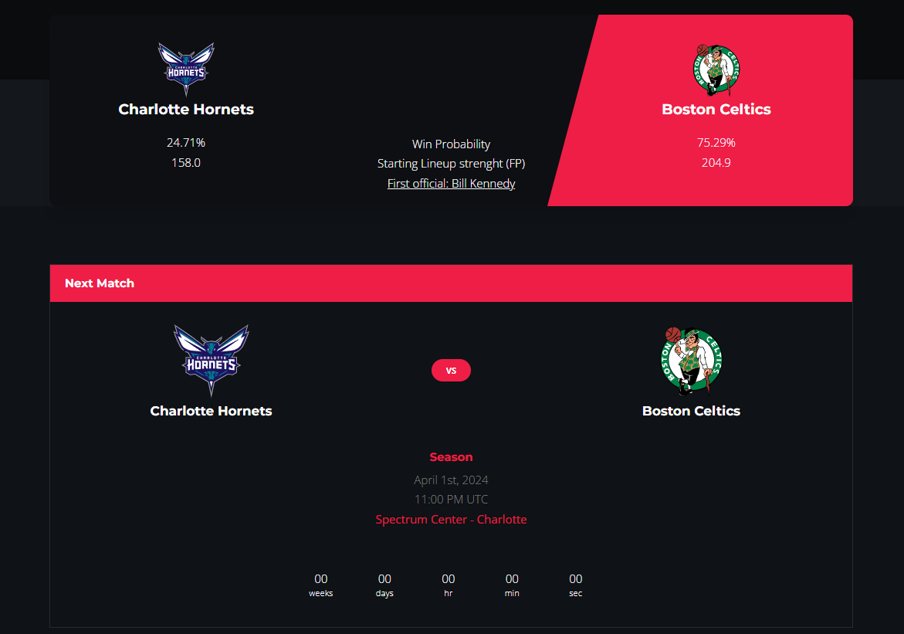

# NBA-Predict

## Overview
NBA-Predict is a web service developed as a final project for the Scalable and Reliable Services M course. The objective is to create a platform that leverages data from the NBA API to provide valuable statistics for predicting NBA game outcomes. For completed games, the service displays the final score and relevant statistics. For upcoming games, machine learning models, trained with historical data from the API, are used to forecast the results. Additionally, the service estimates the strength of the starting teams and provides the name of the lead referee for each match. The service has been deployed on the Microsoft Azure cloud platform to ensure high reliability and resilience.

## Implementation

### NBA API
For forecasting information, the [NBA API](https://github.com/swar/nba_api) package was utilized. NBA API is the official library of NBA.com, designed to make the API easily accessible to users for the purpose of collecting and processing statistics. Written in Python, it allows access to two types of data through HTTP requests: static data and endpoints. Static data consists of commonly available and infrequently modified information related to teams or individual players. Functions such as find_player_by_id() and find_teams_by_nickname() are provided to access this information.

### Flask
For the implementation of the website, [Flask](https://flask.palletsprojects.com/en/3.0.x/) was chosen. Flask is a lightweight micro-framework for Python that offers simple yet powerful tools for creating web applications. It provides a set of essential functionalities for handling HTTP requests, managing sessions, URL routing, and error handling. Flask allows developers to start with a minimal base and add only the necessary features for their specific project.
From a structural perspective, the Flask project is organized as follows:
- **application.py**: The main Python file that defines the Flask app and acts as the glue between the backend written in Python and the HTML frontend.
- **utilities**: A folder containing the following files:
  - **functions.py**: A file where various utilized functions are stored.
  - **populate.py**: A file required to populate the remote database with all the statistics pertaining to the championship.
  - **query.py**: A file through which the queries to be used within the code have been defined.
- **templates**: A folder containing all the HTML pages that make up the website, along with embedded JavaScript functionalities.
- **statics**: A folder containing "static" files such as CSS, JavaScript, Bootstrap, and images that shape the website.
- **update**: A folder containing the necessary Python and JSON files for the realization of a specific feature.

### Microsoft Azure
For this project, [Microsoft Azure](https://azure.microsoft.com/it-it) was utilized to deploy the web application, ensuring high availability and resilience. Microsoft Azure is a comprehensive cloud computing platform and service provided by Microsoft. It offers a wide range of cloud services, including computing power, storage solutions, and networking capabilities, as well as advanced tools for analytics, artificial intelligence, and Internet of Things (IoT). Azure enables businesses to build, deploy, and manage applications through a global network of data centers, providing flexibility, scalability, and reliability. It supports a variety of programming languages, frameworks, and operating systems, making it a versatile choice for developers and enterprises.

## Web App
The web app consists of a series of pages, a few of which are highlighted below:

First, there is the homepage, which serves as the main navigation point of the site, allowing users to access various implemented features.

The homepage features a calendar functionality, allowing users to browse through all the matches of the championship.

The screen above displays the details of a match that has already been played, accessible directly through the calendar: it's possible to view various statistics for each team, the strength of the starting team, and the referee.

Lastly, a screenshot of an upcoming match, also accessible from the calendar, has been included: it's noticeable how there is the probability for each team to win the match, the strength of the starting team, and the appointed referee overseeing the match.

## Usage
To access the web service, please visit the following link: https://nba-predict.azurewebsites.net.

## License
For any inquiries regarding the use or customization of the web service for specific business needs, please contact [Manuel Greco](https://github.com/ManuTheKing), [Michelangelo Florio](https://github.com/MichelangeloFlorio) and [Nicola Paoluzzi](https://github.com/nicolapaoluzzi00).
